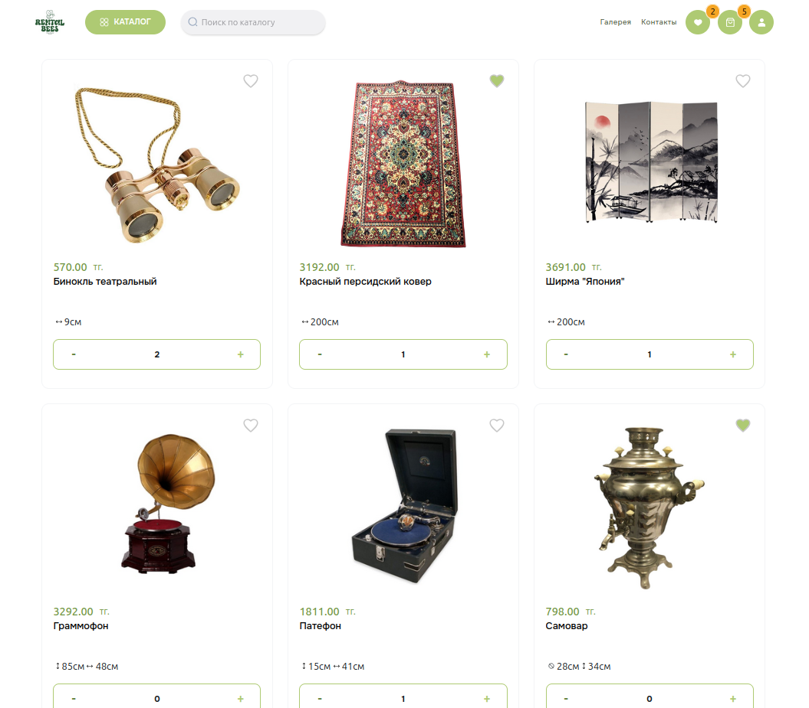
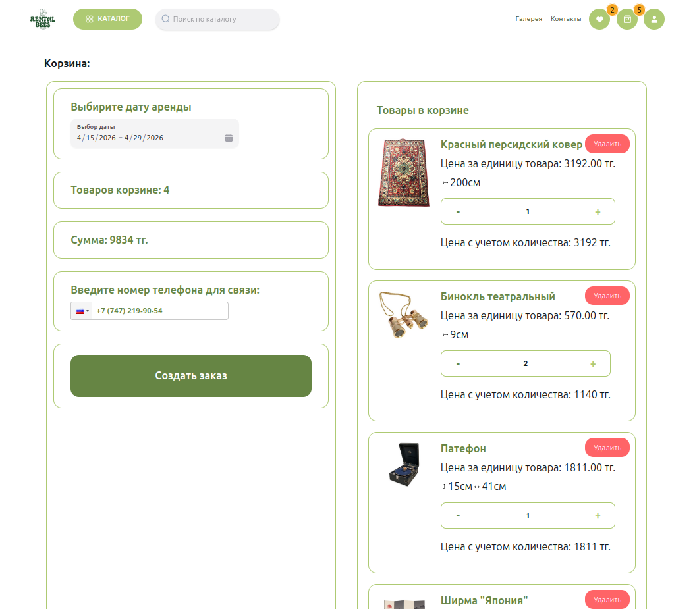

### Проект аренды мебели и декора для мероприятий

---

Платформа для аренды мебели и декора для мероприятий (свадьбы, вечеринки, корпоративы и др.).

Проект разработан с использованием **Next.js** (frontend) и **Django REST Framework (DRF)** (backend).

---

## Функционал

* Просмотр каталога мебели и декора
* Фильтрация и поиск товаров
* Добавление в избранное / корзину
* Бронирование на определённые даты
* Авторизация и регистрация пользователей
* Система лайков / избранного
* Галерея изображений товаров

---

## Технологии

### Frontend

* Next.js
* React
* TypeScript
* Tailwind CSS
* Zustand

### Backend

* Django
* Django REST Framework
* PostgreSQL
* JWT

---

## Установка и запуск

### 1. Клонировать репозиторий

```bash
git clone https://github.com/Baraquda1990/decor_site.git
cd decor_site
```

---

### 2. Backend (Django)

```bash
cd drf
python -m venv venv
source venv/bin/activate

pip install -r requirements.txt

python manage.py migrate
python manage.py runserver
```

---

### 3. Frontend (Next.js)

```bash
cd next
npm install
npm run dev
```

---

## Переменные окружения

### Backend

В файле settings.py необходимо указать адрес сервера django:

```python
WEBSITE_URL='http://127.0.0.1:8000'
```
и настройки для базы данных
```python
DATABASES={
    'default':{
        'ENGINE':'django.db.backends.postgresql',
        'NAME':'Название БД',
        'USER':'Имя пользователя',
        'PASSWORD':'Пароль',
        'HOST':'localhost',
        'PORT':5432,
    }
}
```

### Frontend
В корне проекта (папка next), необходимо создать .env.local
```
NEXT_PUBLIC_DJANGO_HOST=http://127.0.0.1:8000
NEXT_PUBLIC_NEXT_HOST=http://127.0.0.1:3000
```

---

## Скриншоты




---

